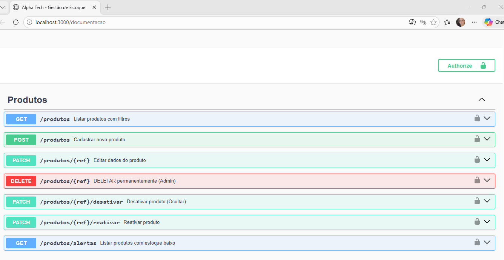
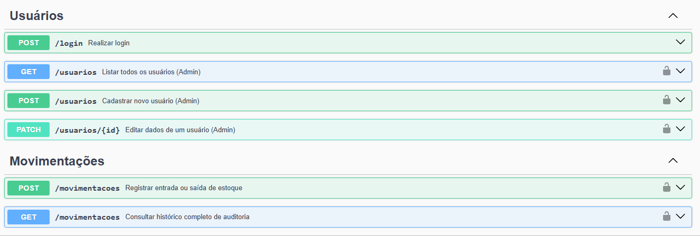
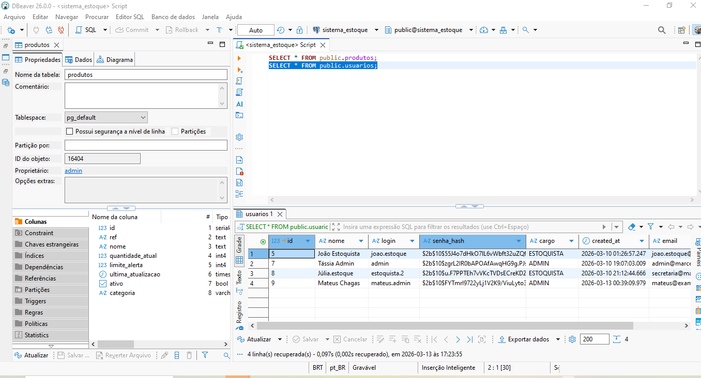

# 📦 Gestão de Estoque Pro

O **Gestão de Estoque Pro** é uma API robusta para controle de estoque, desenvolvida com Node.js e PostgreSQL, totalmente conteinerizada com Docker. O sistema permite o gerenciamento de produtos, usuários, movimentações de entrada/saída e alertas de estoque baixo.

---
## 🛠️ Tecnologias Utilizadas
- Backend: Node.js (Fastify)
- Banco de Dados: PostgreSQL 15
- Infraestrutura: Docker & Docker Compose
- Documentação: Swagger UI
- Segurança: JWT (JSON Web Tokens)
---
## 🐳 Como Executar com Docker
1. **Docker Desktop:** (Certifique-se de que ele esteja baixado e aberto antes de começar).
2. **Git:** Para clonar o código.
3. **VS Code:** Para visualizar o código.
Se acabou de clonar este repositório, siga estes passos para configurar o ambiente:

**Preparar Variáveis de Ambiente**
* Copie o conteúdo de .env.example.
* Crie um ficheiro chamado .env na raiz do projeto.
* Cole o conteúdo e ajuste as suas credenciais.
  
**Subir a Infraestrutura**
Certifique-se de que o Docker Desktop está aberto e execute:
```
docker-compose up -d --build
```
O comando acima constrói a imagem da API, baixa o banco de dados e liga ambos em segundo plano.

**Configuração Automática (Bootstrap)**

O projeto conta com uma lógica de **Bootstrap.** Na primeira vez que o sistema ligar, o servidor verificará se o banco está vazio e criará automaticamente as tabelas e o usuário administrador.

## 🔑 Credenciais de Acesso (Padrão)
Após subir o container pela primeira vez, utilize os dados abaixo para o primeiro login via Swagger:

Login: `admin`

Senha: `admin123`

**Nota:** Estas credenciais podem ser alteradas no seu ficheiro .env antes da primeira execução;
São essenciais para obter o Token JWT no Swagger.

---
### 🌍 Onde vejo o sistema funcionando?
Com o Docker rodando, o servidor já está ativo!

*  API / Documentação (Swagger): : Acesse <http://localhost:3000/documentacao>
   *Aqui você testa login, cadastro e movimentações sem precisar de um Frontend.
   
* 🐘 Porta do Banco (Postgres) `5432`
---
### Dicas de Operação (Cheat Sheet)
Aqui estão os comandos essenciais para gerenciar o ambiente de desenvolvimento:

💡 **Ligar o Sistema**
Sobe os contêineres em segundo plano:
```
docker-compose up -d
```
🔄 **Reiniciar a API**
Útil para aplicar mudanças rápidas no código sem desligar o banco:
```
docker-compose restart app
```
👁️ **Ver logs no terminal (Debug)**
Para "ouvir" o que o servidor está processando (erros, conexões, logs de acesso):
```
docker logs -f estoque_api
```
🛑 **Parar o Sistema**
Desliga os contêineres e libera os recursos do computador:
```
docker-compose down
```
⚠️ **Reset Total (Limpar Dados)**
Para apagar todos os registros do banco e começar do zero **(cuidado!)**:
```
docker-compose down -v
```
---
### 📊 Visualizando os Dados (DBeaver)
Para ver as tabelas e movimentações como um profissional de dados:

1. Conecte seu **DBeaver** ao `localhost:5432`.

2. Use o usuário e senha definidos no seu `.env`.

3. Navegue em `Schemas > public > Tables` para ver os dados.
---
### 🏗️ Arquitetura MVC
Este projeto segue o padrão **Model-View-Controller**, o que o torna organizado e fácil de manter:

- Models: Onde definimos como os dados são salvos no Postgres.

- Controllers: Onde fica a "lógica" (ex: não vender produto sem estoque).

- Routes: Onde definimos os endereços da nossa API.
---
## 📸 Galeria do Sistema

| Documentação Swagger | Teste de Endpoints |
|:---:|:---:|
|  |  |

### 📊 Estrutura do Banco de Dados

---
